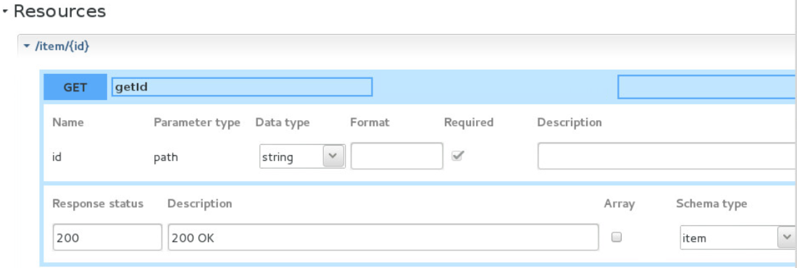
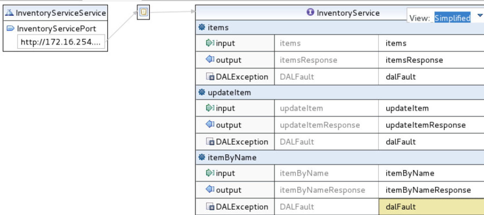
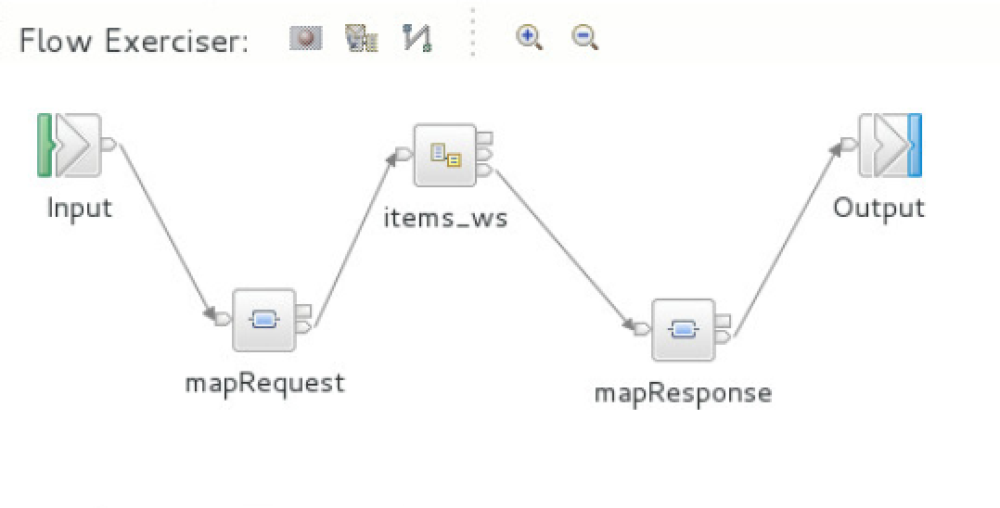
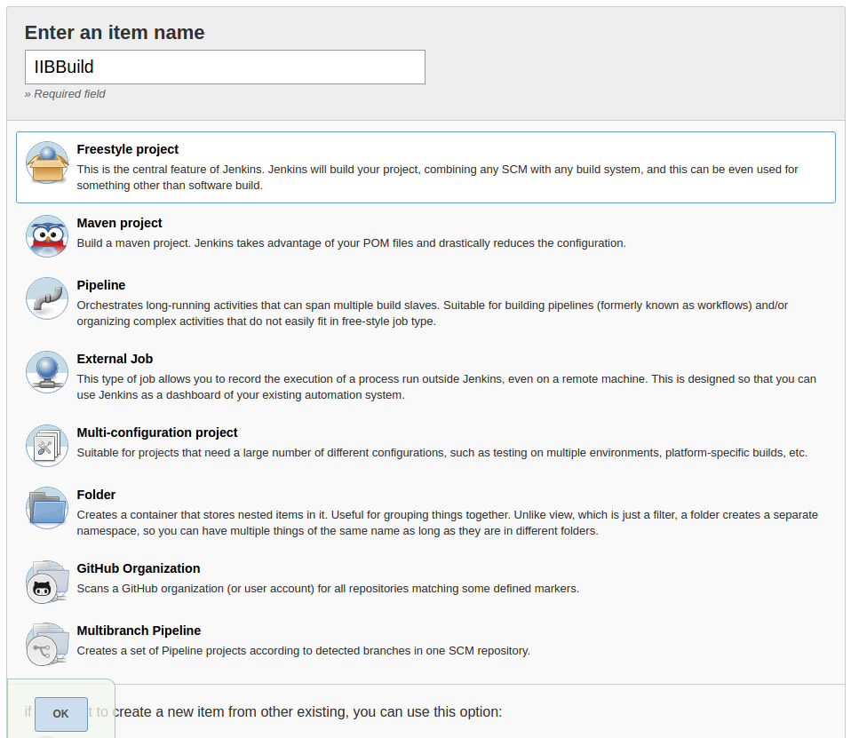
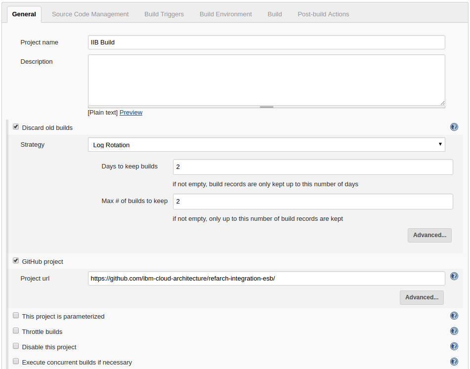
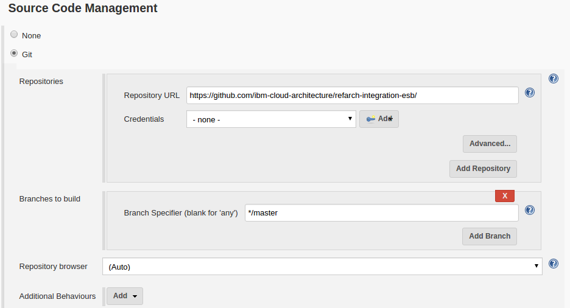
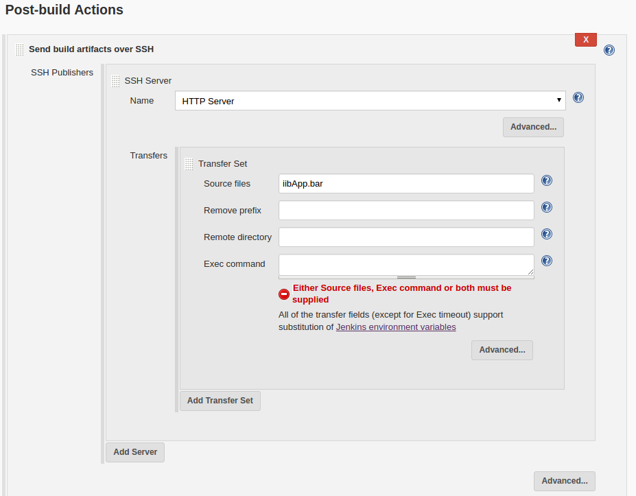

# Inventory Flow - Integration Bus

This project is part of the 'IBM Integration Reference Architecture' suite, available at [https://github.com/ibm-cloud-architecture/refarch-integration](https://github.com/ibm-cloud-architecture/refarch-integration). It demonstrates how an IBM Integration Bus runtime can be deployed on premise, running the gateway flow to expose REST api from a SOAP back end service, and can be deployed to IBM Cloud private.

# Table of Contents
* [IIB background](https://github.com/ibm-cloud-architecture/refarch-integration-esb#ibm-integration-bus-background)
* [Installation](https://github.com/ibm-cloud-architecture/refarch-integration-esb#ibm-integration-bus-background)
* [Flow implementation](https://github.com/ibm-cloud-architecture/refarch-integration-esb#inventory-flow)
* [CI/CD](https://github.com/ibm-cloud-architecture/refarch-integration-esb#cicd)
* [Service Management](https://github.com/ibm-cloud-architecture/refarch-integration-esb#application-performance-management)
* [Compendium](https://github.com/ibm-cloud-architecture/refarch-integration-esb#compendium)

# IBM Integration Bus Background

IBM Integration Bus is a market-leading lightweight enterprise integration engine that offers a fast, simple way for systems and applications to communicate with each other. As a result, it can help you achieve business value, reduce IT complexity and save money.
IBM Integration Bus supports a range of integration choices, skills and interfaces to optimize the value of existing technology investments.

[](https://www.youtube.com/watch?v=qQvT4kJoPTM)


# Server installation
## On-premise
For the on-premise solution a standard installation was done following the instructions from the [product documentation](https://www.ibm.com/support/knowledgecenter/en/SSMKHH_10.0.0/com.ibm.etools.mft.doc/bh25992_.htm).

We created a new virtual machine with one of the supported linux OS.
1. Download the developer edition:    
```
   wget http://public.dhe.ibm.com/ibmdl/export/pub/software/websphere/integration/10.0.0.9-IIB-LINUX64-DEVELOPER.tar.gz
```

1. Install the downloaded file into /opt/ibm:
```
   mkdir /opt/ibm
   tar -xf 10.0.0.9-IIB-LINUX64-DEVELOPER.tar.gz --exclude iib-10.0.0.9/tools --directory /opt/ibm
```
1. Review the license agreement and if acceptable accept using the following
command:
```
   /opt/ibm/iib-10.0.0.9/iib make registry global accept license silently     
```
Remember that to start the IIB toolkit you can use the `<install_dir>/iib toolkit` command.

## Docker
Read [Building a docker image that include IBM Integration Bus and IBM MQ embedded using the Developer Editions](docker/README.md)
# Inventory Flow
This section addresses how the flow was created. We develop a REST API using IBM Integration Toolkit. ([See product documentation])(https://www.ibm.com/support/knowledgecenter/en/SSMKHH_10.0.0/com.ibm.etools.mft.doc/bi12036_.htm)

If you want to access the project, open the toolkit and use import > General > Import existing project, then select the refarch-integration-esb/integration/RESTAPI project.

In the API Description the base URL is set to **iib/inventory-api** (this is defined in the header section), then for the resources the following operations are defined:
* /item/{id} GET, PUT, DELETE
* /items GET, POST



The model definition defined item and items as:


The service to consume is from the [Data Access Layer]() project, and represents a SOAP WSDL interface, as illustrated in following figure:



The project needs to do protocol and data mapping, via the implementation of flows. ([See product documentation](https://www.ibm.com/support/knowledgecenter/en/SSMKHH_10.0.0/com.ibm.etools.mft.doc/bi12020_.htm)).
The flow below presents the get items operation:   



The input string is mapped to the itemid for the soap request, the call to the DAL SOAP service is done inside the items_ws node:

  

and the response is mapped back to json item array in the mapResponse node:


The same logic / implementation pattern is done for the other flows supporting each REST operations. All the flows are defined in the integration/RESTAPI folder.

| Operation | Flow name | Map |
| --------- | -------- | ----- |
| get item  | getId.subflow | getId_mapRequest, getId_mapResponse |
| put item  | putId.subflow | putId_mapRequest, putId_mapResponse |
| delete item  | deleteId.subflow | deleteId_mapRequest, deleteId_mapResponse |
| get items | getItems.subflow | getItems_mapRequest, getItems_mapResponse |
| post items | postItems.subflow | postItems_mapRequest, postItems_mapResponse |

# CI/CD

The elements of the IIB project are text files that are pushed to github repository. It is easy to Jenkins automate build so it can be deployed depending on the target.

## Prerequisite
As a prerequisite, IBM Integration Bus needs to be installed on the Jenkins machine. See instructions
in [main readme](https://github.com/ibm-cloud-architecture/refarch-integration-esb#on-premise)  

The steps can be summarized as:
1. Within Jenkins setup an SSH server that hosts the HTTP Server where the package BAR file will be hosted. This requires the *Publish over SSH* plugin to be installed on the Jenkins server.     
   

1. Create a new Jenkins Item as a Freestyle project:         
   
   
1. In the General section specify:    
   * Discard old builds after 2 days and 2 maximum builds
   * Github project is http//github.com/ibm-cloud-architecture/refarch-integration-esb  
   
   
1. In the Source Code Management section specify:
   * Git
   * Repository: http//github.com/ibm-cloud-architecture/refarch-integration-esb       
       

1. In the build section, select *Execute shell* and enter:     
   ```
       chmod a+x $WORKSPACE/deploy/buildIIB.sh
       $WORKSPACE/deploy/buildIIB.sh
   ```
    

1. In the Post-build Actions section specify: 
   * Send build artifacts over SSH 
   * Source files: iibApp.bar
   

# Deployment
There are three options for deployment:
1. Deploy manually using Docker 
2. IBM Cloud private
3. Traditional On-Premise

## Deploy manually using Docker 
See the article [Deploying the application using Docker locally](deploy/README.md)

## IBM Cloud private
See the article [Deploying a new instance of IBM Integration Bus on IBM Cloud private deploying the newly created application](IBMCloudprivate/README.md)

## Traditional On-Premise
Follow the standard deployment steps document in the [knowledge center](https://www.ibm.com/support/knowledgecenter/en/SSMKHH_10.0.0/com.ibm.etools.mft.doc/af03890_.htm)

# Application Performance Management

To get visibility into the IIB runtime and server performance metrics, a APM agent is installed on the server.
[The instructions are here](https://www.ibm.com/support/knowledgecenter/SSHLNR_8.1.4/com.ibm.pm.doc/install/iib_linux_aix_config_agent.htm#iib_linux_aix_config_agent)

# Compendium

* [View the IBM Integration Bus Dockerfile repository on Github](https://github.com/ot4i/iib-docker)

* [Learn more about IBM Integration Bus Docker Tips and Tricks](https://developer.ibm.com/integration/blog/2017/04/04/ibm-integration-bus-docker-tips-tricks/)

* [Learn more about IBM Integration Bus and Kubernetes](https://developer.ibm.com/integration/blog/2017/08/21/first-look-using-ibm-integration-bus-kubernetes/)

* [Learn more about running IBM Integration Bus in the Bluemix Container Service](https://developer.ibm.com/integration/blog/2016/11/18/run-ibm-integration-bus-in-bluemix-in-3-easy-steps/)

* [Learn more about IBM Integration Bus](https://www.ibm.com/support/knowledgecenter/en/SSMKHH_10.0.0/com.ibm.etools.msgbroker.helphome.doc/help_home_msgbroker.htm)

* [Learn more about IBM Integration Bus and Docker](https://www.ibm.com/support/knowledgecenter/en/SSMKHH_10.0.0/com.ibm.etools.mft.doc/bz91300_.htm)
