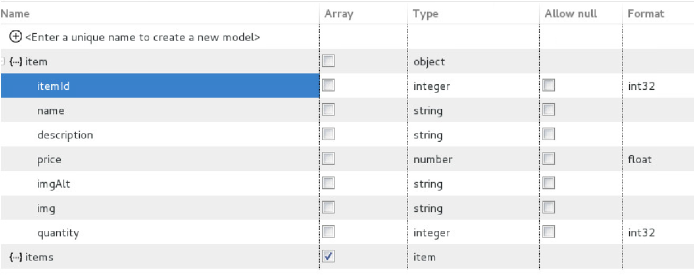

# Inventory Flow - Integration Bus

This project is part of the 'IBM Integration Reference Architecture' suite, available at [https://github.com/ibm-cloud-architecture/refarch-integration](https://github.com/ibm-cloud-architecture/refarch-integration). It demonstrates how an IBM Integration Bus runtime can be deployed on premise, running the gateway flow to expose REST api from a SOAP back end service, and can be deployed to IBM Cloud private.

# Table of Contents
* [IIB background]()
* [Installation]

## IBM Integration Bus Background

IBM Integration Bus is a market-leading lightweight enterprise integration engine that offers a fast, simple way for systems and applications to communicate with each other. As a result, it can help you achieve business value, reduce IT complexity and save money.
IBM Integration Bus supports a range of integration choices, skills and interfaces to optimize the value of existing technology investments.

# Server installation
## On-premise
For the on-premise solution a standard installation was done following the instructions from the [product documentation](https://www.ibm.com/support/knowledgecenter/en/SSMKHH_10.0.0/com.ibm.etools.mft.doc/bh25992_.htm).

Remember that to start the IIB toolkit you can use the `<install_dir>/iib toolkit` command.

## Docker
Read [Building a docker image that include IBM Integration Bus and IBM MQ embedded using the Developer Editions](docker/README.md)
## Helm chart
Read [Creating a helm chart compatible with IBM Cloud private and deploying to a runtime](helm/readme.md)
## IBM Cloud private
See the article [Deploying a new instance of IBM Integration Bus on IBM Cloud private deploying the newly created application](deploy/README.md)
# Inventory Flow
This section addresses how the flow was created. We develop a REST API using IBM Integration Toolkit. ([See product documentation])(https://www.ibm.com/support/knowledgecenter/en/SSMKHH_10.0.0/com.ibm.etools.mft.doc/bi12036_.htm)

If you want to access the project, open the toolkit and use import > General > Import existing project, then select the refarch-integration-esb/integration/RESTAPI project.

In the API Description the base URL is set to **iib/inventory-api** (this is defined in the header section), then for the resources the following operations are defined:
* /item/{id} GET, PUT, DELETE
* /items GET, POST

The model definition defined item and items as:

The service to consume is from the [Data Access Layer]() project, and represents a SOAP WSDL interface, as illustrated in following figure:

The project needs to do protocol and data mapping, via the implementation of flows. ([See product documentation](https://www.ibm.com/support/knowledgecenter/en/SSMKHH_10.0.0/com.ibm.etools.mft.doc/bi12020_.htm)).
The flow below presents the get items operation:   

The input string is mapped to the itemid for the soap request, the call to the DAL SOAP service is done inside the items_ws node:

  

and the response is mapped back to json item array in the mapResponse node:

The same logic / implementation pattern is done for the other flows supporting each REST operations. All the flows are defined in the integration/RESTAPI folder.
| Operation | Flow name | Map |
| get item  | getId.subflow | getId_mapRequest, getId_mapResponse |
| | | |
| -- | -- | -- | -- |
# CI/CD

The elements of the IIB project are text files that are pushed to github repository. 
 TBD
# CSMO

[Here](https://www.ibm.com/support/knowledgecenter/SSHLNR_8.1.4/com.ibm.pm.doc/install/iib_linux_aix_config_agent.htm#iib_linux_aix_config_agent)
