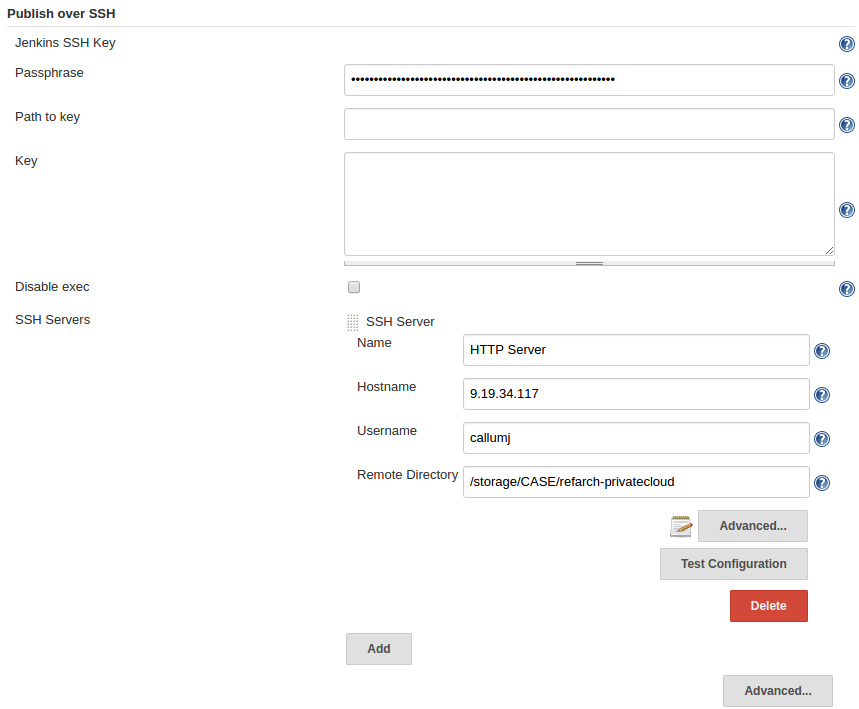
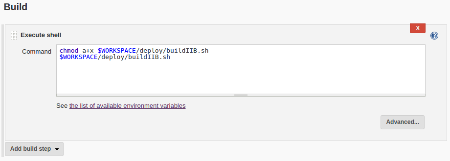

# Inventory Flow - Integration Bus

This project is part of the 'IBM Integration Reference Architecture' suite, available at [https://github.com/ibm-cloud-architecture/refarch-integration](https://github.com/ibm-cloud-architecture/refarch-integration).

The goal of this project is to demonstrate how an IBM Integration Bus runtime can be deployed on premise or on IBM Cloud Private, running the gateway flows to expose REST api from SOAP back end services. We are implementing simple interface mapping flows.

# Table of Contents
* [IIB background](#ibm-integration-bus-background)
* [Server Installations](#server-installation)
* [Flow implementation tutorial](./docs/tutorial/README.md)
* [Deployment](#deployment)
* [CI/CD](#cicd)
* [Service Management](https://github.com/ibm-cloud-architecture/refarch-integration-esb#application-performance-management)
* [Compendium](https://github.com/ibm-cloud-architecture/refarch-integration#compendium)

# IBM Integration Bus Background

IBM Integration Bus is a market-leading lightweight enterprise integration engine that offers a fast, simple way for systems and applications to communicate with each other. As a result, it can help you achieve business value, reduce IT complexity and save money.  
IBM Integration Bus supports a range of integration choices, skills and interfaces to optimize the value of existing technology investments. But also IIB now provides an extremely lightweight integration runtime with first class support for modern protocols such as REST and is well aligned with cloud native deployment needs.  
The runtime can now be stopped and started in seconds. It runs in docker containers, and can make building and deploying stateless integration logic following any cloud native application development pattern. It offers great capabilities to develop REST api, integrate with backend, event streaming, and SOA services.  
There are different adoption patterns which can be considered for integration and messaging:
* support universal messaging layer (IBM MQ) that can provide asynchronous messaging with assured once-and-only-once delivery of messages between disparate systems, with support for point-to-point and publish-subscribe patterns. As part of this model, MQTT can be used as a lightweight messaging protocol for IoT devices.
* support for managed file transfer solution to move files of any size reliably, with checkpoint restart, security, end-to-end encryption, compression, etc. IIB support FTP, SFTP protocols.
* Service integration in SOA using gateway pattern, interface mapping, with securing end point, with integration with service registry. The integration is between domains with different QoS or security characteristics, or even just different ownership
* Cloud integration by adopting more and more cloud-based or Software as a Service (SaaS) based applications, to take advantage of not having to host and manage as much hardware and applications internally.
* API economy, APIs are the new way to flexibly expose data and function to developers outside your own team, either internal developers or external developers. Importantly, via the community centric API catalog, APIs can be found and consumed easily. APIs are most commonly exposed as REST/JSON.

# Server Installations
We can run IIB directly on bare-metal or virtual machine servers, or as docker container on public or private cloud. In our environment we have one dedicated VM to run IIB. It is not set to be high available, as we do not need to proof that IIB can be HA. We want to focus basic functional requirements and address other non-functional requirements that make more sense in an hybrid solution like CI/CD and service management.

## Virtual Machine deployment
For the VM deployment, we used a standard installation following the instructions from the [product documentation](https://www.ibm.com/support/knowledgecenter/en/SSMKHH_10.0.0/com.ibm.etools.mft.doc/bh25992_.htm).

We created a new virtual machine with one of the supported linux OS.
1. Download the developer edition:    
 ```
   wget http://public.dhe.ibm.com/ibmdl/export/pub/software/websphere/integration/10.0.0.9-IIB-LINUX64-DEVELOPER.tar.gz
 ```

1. Install the downloaded file into /opt/ibm:
 ```
   mkdir /opt/ibm
   tar -xf 10.0.0.9-IIB-LINUX64-DEVELOPER.tar.gz --exclude iib-10.0.0.9/tools --directory /opt/ibm
 ```
1. Review the license agreement and if acceptable accept using the following
command:
 ```
   /opt/ibm/iib-10.0.0.9/iib make registry global accept license silently     
 ```
1. Add a user and be sure it is part of the admin/root group, it is a sudoers and added to the group mqbrkrs.

 To start the IIB toolkit you can use the `<install_dir>/iib toolkit` command. (e.g. `/opt/ibm/iib/ibb-10.0.09/iib toolkit`)

## Docker
IIB can run in docker and we detailed the approach in this note: [Building a docker image that include IBM Integration Bus and IBM MQ embedded using the Developer Editions](docker/README.md)

## IBM Cloud Private
The deployment of IIB on ICP may follow two paths that we are presenting in a [separate note](docs/icp/README.md)


# Deployment
There are three options for IIB application deployment:
1. Deploy manually using Docker
2. Deploy on IBM Cloud Private using Helm
3. Traditional On-Premise using IIB commands

To implement the [lightweight integration](https://developer.ibm.com/integration/blog/2017/03/31/lightweight-integration-iib/)  strategy and development practices we are moving the mediation flow within container embedding IIB runtime.

## Deploy manually using Docker
See the article [Deploying the application using Docker locally](deploy/README.md)

## Deploy to IBM Cloud Private
See the article [Deploying a new instance of IBM Integration Bus on IBM Cloud Private deploying the newly created application](docs/icp/README.md)

## Deploy to traditional on-premise IIB server
Follow the standard deployment steps document in the [knowledge center](https://www.ibm.com/support/knowledgecenter/en/SSMKHH_10.0.0/com.ibm.etools.mft.doc/af03890_.htm)

# CI/CD

The elements of the IIB project are text files that are pushed to github repository. It is easy to use Jenkins to automate build and deployment. This section presents what can be done.

## Prerequisite
As a prerequisite, IBM Integration Bus needs to be installed on the Jenkins machine. See instructions
in [main readme](https://github.com/ibm-cloud-architecture/refarch-integration-esb#virtual-machine-deployment)  

The steps can be summarized as:
1. Within Jenkins setup an SSH server that hosts the HTTP Server where the package BAR file will be hosted. This requires the *Publish over SSH* plugin to be installed on the Jenkins server.     
   

1. Create a new Jenkins Item as a Freestyle project:         
   

1. In the General section specify:    
   * Discard old builds after 2 days and 2 maximum builds
   * Github project is http//github.com/ibm-cloud-architecture/refarch-integration-esb  
   

1. In the Source Code Management section specify:
   * Git
   * Repository: http//github.com/ibm-cloud-architecture/refarch-integration-esb       
       

1. In the build section, select *Execute shell* and enter:     
   ```
       chmod a+x $WORKSPACE/deploy/buildIIB.sh
       $WORKSPACE/deploy/buildIIB.sh
   ```
   

1. In the Post-build Actions section specify:
   * Send build artifacts over SSH
   * Source files: iibApp.bar
   


# Application Performance Management

To get visibility into the IIB runtime and server performance metrics, a APM agent is installed on the server.
[The instructions are here](https://www.ibm.com/support/knowledgecenter/SSHLNR_8.1.4/com.ibm.pm.doc/install/iib_linux_aix_config_agent.htm#iib_linux_aix_config_agent)

# Compendium
* [See the hybrid integration global compendium](https://github.com/ibm-cloud-architecture/refarch-integration/blob/master/docs/compendium.md)
* [Introduction video to IIB](https://www.youtube.com/watch?v=qQvT4kJoPTM)
* [IIB developer works tutorials](https://developer.ibm.com/integration/docs/ibm-integration-bus/tutorials)
* [Getting started with IIB](https://developer.ibm.com/integration/docs/ibm-integration-bus/get-started/get-started-with-ibm-integration-bus-for-developers/)
* [Developing a REST API service lab](https://developer.ibm.com/integration/docs/ibm-integration-bus/self-study-labs/iib10-lab-2-developing-a-rest-api-service/)
