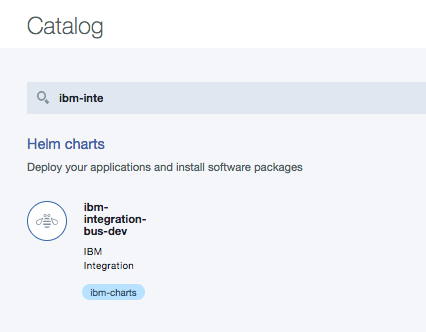
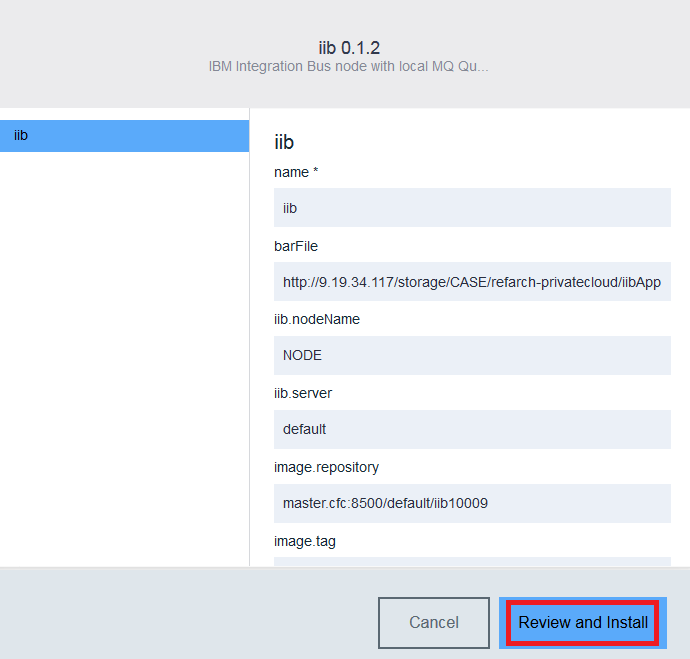
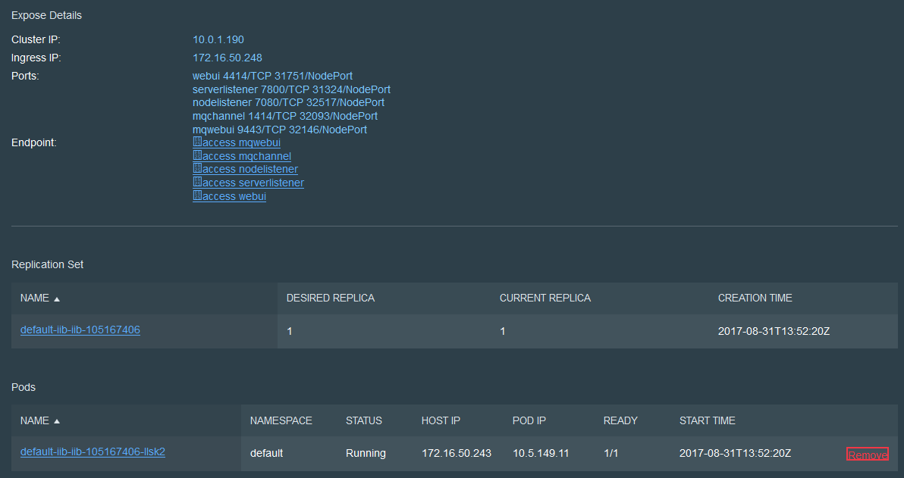

# Deploy a message flow with IIB to IBM Cloud Private
Microservice architecture discussions are often heavily focused on alternate ways to build applications, but the core ideas behind it are relevant to all software components, including integration.
Lightweight runtimes bring interesting ways to develop integration logic, where monolytic integration / ESB flows could be breaked out to smaller more manageable pieces.

Within a microservice architecture, we assert that it is perfectly reasonable to implement integration logic using an integration engine

There are two ways to deploy IIB: using your own packaging or using ICP catalog.

# Using ICP catalog
Go to ICP catalog and search for ibm-integration-bus-dev:

This chart deploys a single IBM Integration Bus for Developers integration node, containing a single integration server into an IBM Cloud Private.

Use the **configure** button at the bottom and enter the name of the chart release: **inventory-mediation-flow** and the namespace to use: **browncompute**.

Alternately use the helm command:
```
$ helm install --name inventory-mediation-flow ibm-integration-bud-dev --set license=accept --namespace=browncompute
```
Once deployed, go to the Deployments menu to consult the settings, or use **kubectl get all** command. Be sure to be connected to the ICP cluster with commands like:
```shell
$ kubectl config set-cluster vh-icp-21-master.icp --server=https://abracadabra:8001 --insecure-skip-tls-verify=true
$ kubectl config set-context vh-icp-21-master.icp-context --cluster=vh-icp-21-master.icp
$ kubectl config set-credentials vh-icp-21-master.icp-user --token=eyJhbGci...
$ kubectl config set-context vh-icp-21-master.icp-context --user=vh-icp-21-master.icp-user --namespace=default
$ kubectl config use-context vh-icp-21-master.icp-context
```

Then

```shell
 $ kubectl get all -l release=inventory-mediation-flow --namespace=browncompute

 NAME                           CLUSTER-IP    EXTERNAL-IP   PORT(S)                                        AGE
svc/inventory-mediation-flow   10.101.0.81   <nodes>       4414:30653/TCP,7800:31506/TCP,7080:30110/TCP   10m

NAME                              DESIRED   CURRENT   UP-TO-DATE   AVAILABLE   AGE
deploy/inventory-mediation-flow   1         1         1            1           10m
```

So this container is running IIB and it is ready to receive mediation flow. To do so we will use kubectl exec command.
```shell
# Get deployment
$ kubectl describe deployment inventory-mediation-flow     --namespace=browncompute
# get the pod name
$ export POD_NAME=$(kubectl get pods --namespace browncompute -l "app=inventory-mediation-flow" -o jsonpath="{.items[0].metadata.name}")
# to see all pods within a namespace
$ kubectl get pods --namespace=browncompute
# get long description of pod
$ kubectl describe pods  $POD_NAME --namespace=browncompute
# get description for the services
kubectl describe svc inventory-mediation-flow     --namespace=browncompute

```

# Build your own packaging
This is straight forward to build your own helm chart so you can bring your own IIB runtime and mediation flow. There are three steps:   
1. Publishing the docker container to a suitable docker repository
2. Creating the helm chart
3. Deploying an instance of IIB with our application

## Publishing the docker container to a suitable docker repository

We assume you have already completed the instructions to [create the docker image locally](../docker/README.md)

The docker images repository is currently located on your local machine, and often it will be required to publish into a central docker repository.

For instance the docker repository associated with an IBM Cloud Private environment or the Bluemix Container Repository. The following instructions document the process to push the image, and are a walk through of the process documented within the knowledge center:
https://www.ibm.com/support/knowledgecenter/en/SSBS6K_1.2.0/manage_images/using_docker_cli.html

1. The IBM Cloud Private master node IP address needs to be identified, this can be found in the top left corner of the admin console:    

   

   This will be hosting the docker repository normally on port **8500**.

1. The master.cfc hostname needs to resolve locally to the identified IP address. Therefore a new entry will be added into the local host file:     
   vi /etc/hosts     
   172.16.251.87    master.cfc     
   

1. Login into the ICP master node and copy the  /<installation_directory>/misc/configure-registry-cert.sh file to the local machine. This file includes the public SSH key to connect to the master node.

1. Run the downloaded script file:
```    
   sudo ./configure-registry-cert.sh
```
1. The script will install a new certificate on the machine, docker needs to be restarted to pick up the change:     
```
   service ssh restart
   service docker restart
```

1. You should now be able to login to the docker repository:
```     
   docker login master.cfc:8500
```
   Login in as the administrator of the repository: *admin*
   using the same pass that you use for the web administration console

1. The create image can now be tagged and uploaded to the docker repository:    
```
   docker tag iib10009 master.cfc:8500/default/iib10009:dev
   docker push master.cfc:8500/default/iib10009:dev
```

## Creating the helm chart
Read this article for 'how to': [Creating a helm chart compatible with IBM Cloud Private and deploying to a runtime](../helm/readme.md)

## Deploying an instance of IIB with our application

### Prerequisite
As a prerequisite, IBM Integration Bus needs to be installed on the machine. See instructions
in [main readme](https://github.com/ibm-cloud-architecture/refarch-integration-esb#on-premise)  
* It is assumed that you have already cloned the git repository


### Building the IBM Integration Bus Application

1. Run the mqsiprofile command to setup the environment:
```
   . /opt/ibm/iib-10.0.0.9/server/bin/mqsiprofile
```

1. Run the following command to generate the BAR file:
```
   mqsipackagebar -a iibApp.bar -w /iibmqDocker/refarch-integration-esb/integration -k RESTAPI
```

1. Upload the BAR file to an HTTP Server so it can be available to the docker engine during start-up. Use whatever mechanism you like to upload the file to the HTTP server, I used scp:     
```
   scp iibApp.bar callumj@9.19.34.xxx:/storage/CASE/refarch-privatecloud   
```

### Creating an Application instance in IBM Cloud Private - App Center

1. Log into the IBM Cloud Private Web UI, and navigate to the System page, and click **Sync Up Repository**:  

   
   Confirm the Sync operation.

1. Open the **App Center**, and type IIB within the search bar:      

   

1. Click on the **Install Package** button, and customize the locations for your Integration Bar file, and potentially the Docker image. Click **Review and install** button to view the final configuration:     

   

1. Click **Install** to start the installation process.

1. A success pop-up will appear.

1.  Navigate to the Applications section:      

    

1. Within the search bar enter **iib** and an application should be shown:   

        
   At this stage it may show the available as **0** as the containers are still being created.

1. Click into the application to view the details:  
   

1. To verify the solution is working by clicking on the **access webui** link. This should load the IIB Web UI within a browser.
