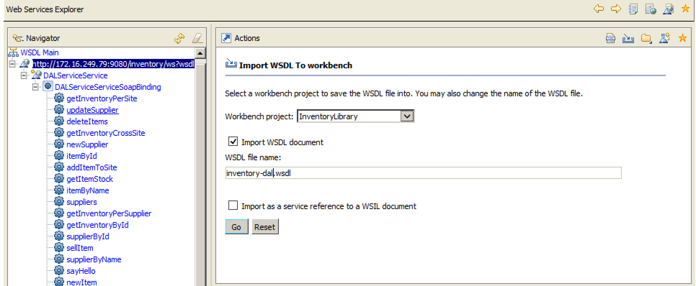

# How to develop a REST API which integrates with a SOAP backend
May be it is yet another tutorial on IIB, but I found the product documentation a little bit unclear, and some existing videos / tutorial being too light. So how to really do a message flow that exposes RESTful APIs and map each resource to SOAP service operations. The source for the SOAP interface is defined in the [data access layer](https://github.com/ibm-cloud-architecture/refarch-integration-inventory-dal) project. This java application runs on liberty and is deployed on IBM Cloud Private exposed by Ingress rule to a host named: `dal.brown.case`. This application exposes CRUD operations for three entities: item, inventory and supplier. Imagine it was done ten years ago. Today, it will be split into two or even three micro services, one per entity. In fact the micro service granularity will depend of the business logic ownership. In this case we can imagine one group own the inventory management.

## Pre-requisite
You could use docker to run IIB runtime. For instruction on how we did build the mq, iib runtime and iib-toolkit image read [this note](../../docker/README.md)

## Step by step tutorial
The solution expose a RESTapi to be consumed by API Connect or directly from web application. As introduce in [this knowledge center note](ttps://developer.ibm.com/integration/docs/ibm-integration-bus/get-started-developing-an-integration-solution-overview/) the steps to consider for developing an integration application are:  

## 1- Select the implementation style
We start by using a REST api, so focusing on the consumer contract first. Start the Integration toolkit with the command `iib toolkit`

## 2 - Decide on reusable content that will be part of Library.
We like reuse. Payload definition like item, inventory, supplier object may be reusable.
1. Create a REST API application using the Integration toolkit product.
1. Define the resources and operations that will be exposed by the API using a swagger file. (See file in integration/InventoryRESapi/inventory-api_1.0.0.yaml). You can edit the file using a Swagger editor online at https://editor.swagger.io/.  
   

 When designing REST API the following are good practices we used:
 * Use plural noun and no verb for the resource URL
 * Use PUT to alter state of an entity, and POST to create new entity
 * Use sub-resources for relations like a supplier of an item
 * Use query as part of the URL to filter entities, and paging
 * API Version in the API
 * PUT is idempotent http verb: calling it once should have the same effect as calling it multiple times. So use {id} parameter as part of the URL, to avoid potential issue on intermediate nodes in the path between the client and server, and it has to have the sane resource as the GET it comes from.
 * Handle error with HTTP status code
    * 200 – OK – Everything is working
    * 201 – OK – New resource has been created
    * 204 – OK – The resource was successfully deleted
    * 304 – Not Modified – The client can use cached data
    * 400 – Bad Request – Use error Payload
    * 401 – Unauthorized
    * 403 – Forbidden – The server understood the request, but is refusing it or the access is not allowed.
    * 404 – Not found – There is no resource behind the URI.
    * 422 – Non processable Entity – Should be used if the server cannot process the entity, e.g. if an image cannot be formatted or mandatory fields are missing in the payload.
    * 500 – Internal Server Error
1. Define the data model (e.g. item and items objects were defined in the swagger file).
1. Import the WSDL to consume using the Web Services Explorer (Import > Web services > Web Service), use the deployed DAL project at an URL like (http://dal.brown.case/inventory/ws?wsdl) and then import the wsdl into your project / workbench.  
  

1. For each operation create a subflow using the icon close to the trash in the API editor:
 

 The flow has input and output nodes added automatically, we need to add mappings from string or JSON to XMP, add SOAP request and mapping back. Here is an example for get item by id: the id is in the URL parameters.
   

 * drag and drop SOAP request node and map the node property to the SOAP operation of the WSDL. For example `getItemId` of the REST api is mapped to `itemById` SOAP binding operation.
 * Define maps to map REST input to XML input and then XML output response to JSON object. (see [this note in knowledge center ](https://www.ibm.com/support/knowledgecenter/SSMKHH_10.0.0/com.ibm.etools.mft.doc/sm12030_.htm))

If you want to access the project, open the IIB toolkit and use import > General > Import existing project, then select the `refarch-integration-esb/integration/inventory` project.

In the API Description the base URL is set to **iib-inventory-api** (this is defined in the header section), then for the resources the following operations are defined:
```
* /item/{id} GET, PUT, DELETE
* /items GET, POST
```
