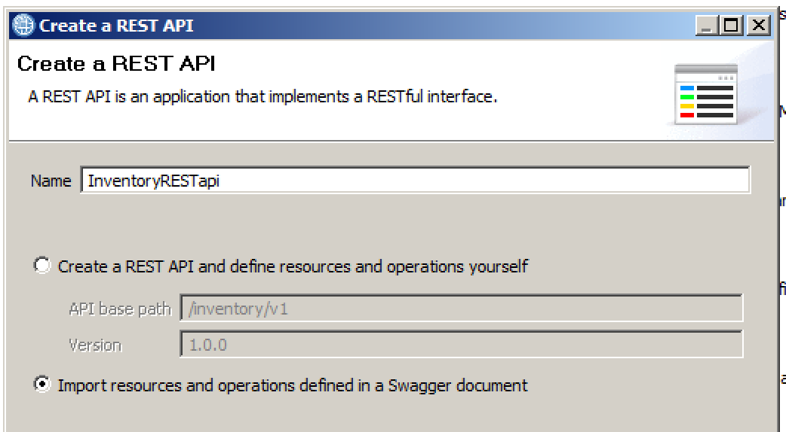
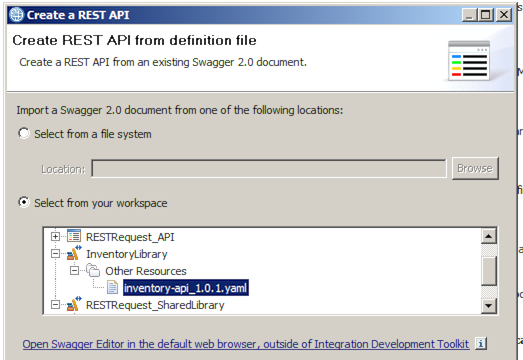
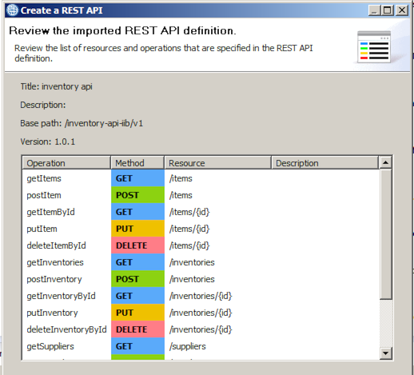
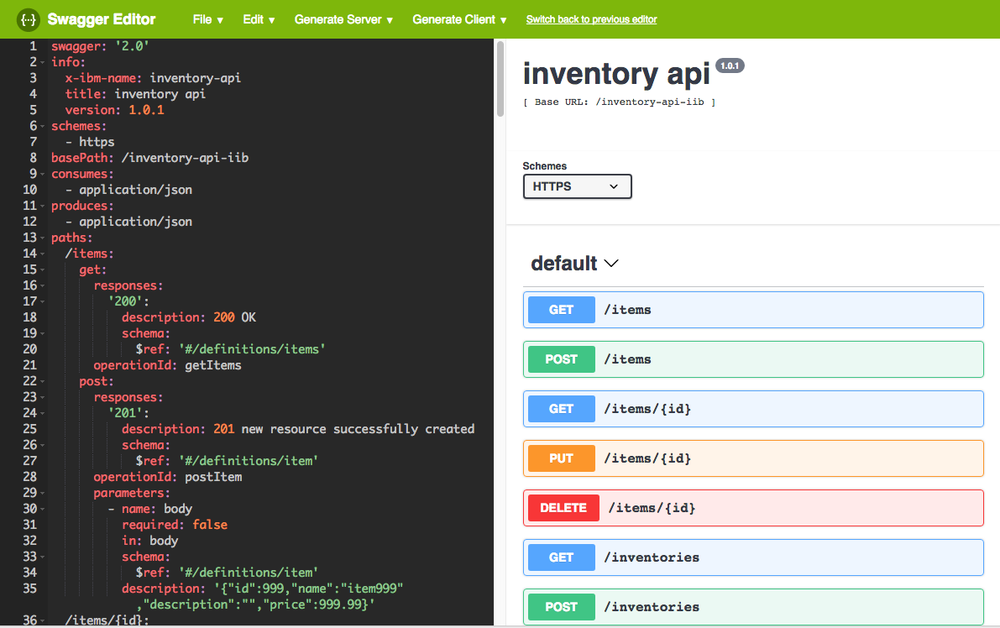
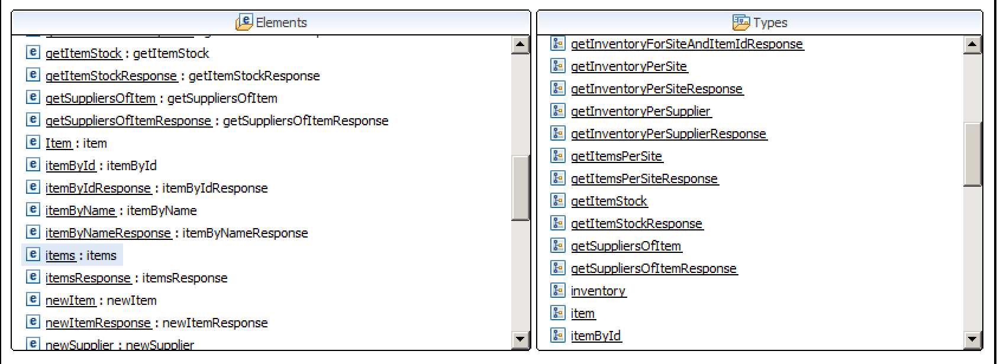
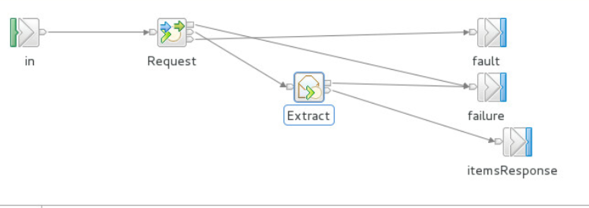
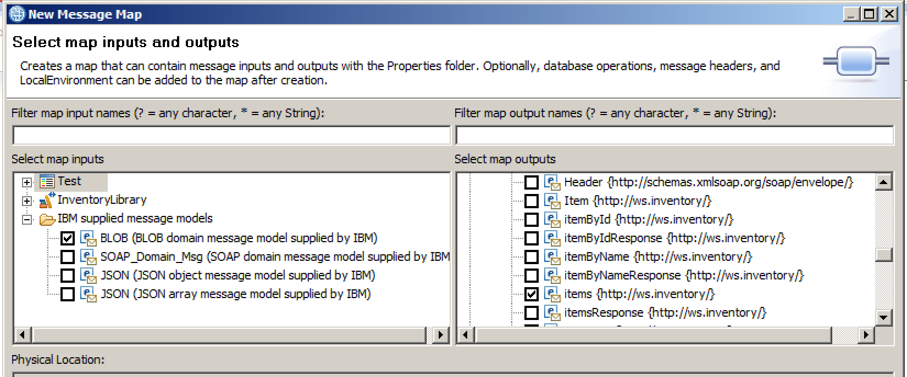
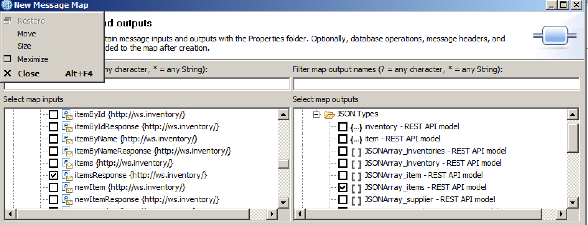
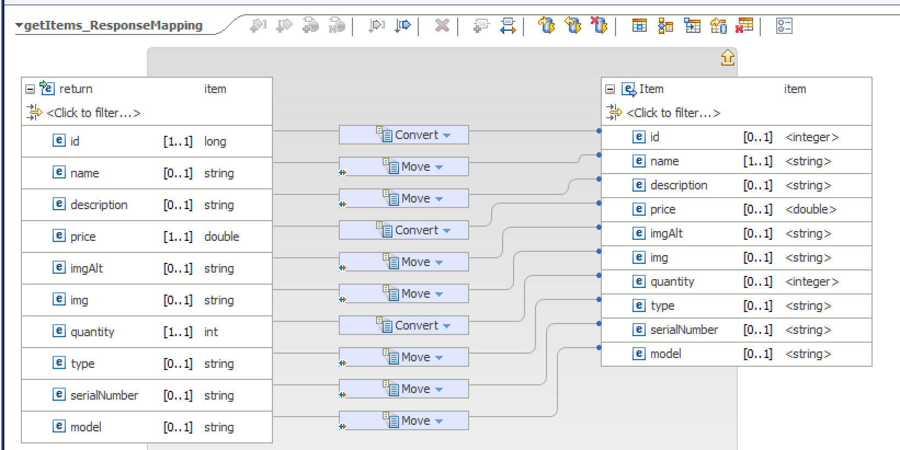
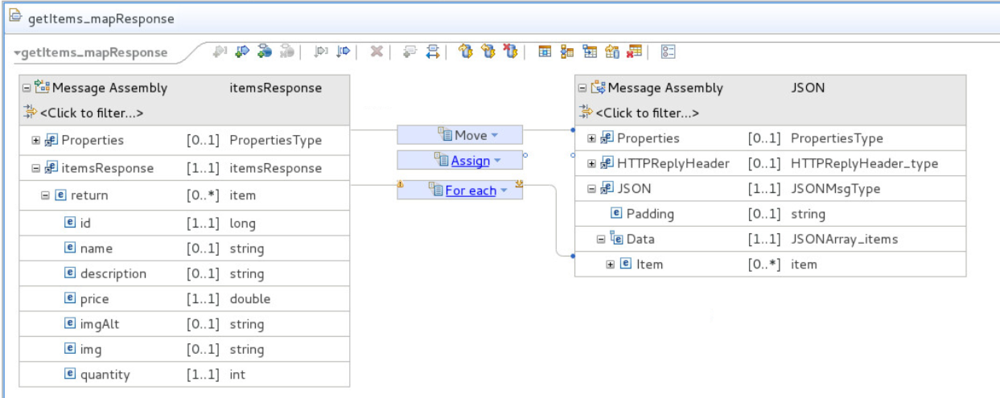

# How to develop a REST API which integrates with a SOAP backend
May be it is yet another tutorial on IIB, but I found the product documentation a little bit unclear, and some existing videos / tutorial being too light or start with pre-requisite done. So we will try to explain how to really do a REST api that exposes RESTful APIs and map each resource to an existing SOAP service operations. The source for the SOAP interface is defined in the [data access layer](https://github.com/ibm-cloud-architecture/refarch-integration-inventory-dal) project. This java application runs on liberty and is deployed on IBM Cloud Private exposed by Ingress rule to a host named: `dal.brown.case`. This application exposes CRUD operations for three entities: item, inventory and supplier. Imagine it was done ten years ago. Today, it will be split into two or even three micro services, one per entity. In fact the micro service granularity will depend of the business logic ownership. In this case we can imagine one group own the inventory management.

## Pre-requisites
You could use docker to run IIB runtime. For instruction on how we did build the mq, iib runtime image read [this note](../../docker/README.md), or you can use IIB Toolkit on Windows by installing the developer edition.
Be sure to reuse the swagger () and WSDL files ().

## Step by step tutorial
This section addresses how the SOAP to REST mediation flow was created. We develop a REST API using IBM Integration Toolkit ([See product documentation](https://www.ibm.com/support/knowledgecenter/en/SSMKHH_10.0.0/com.ibm.etools.mft.doc/bi12036_.htm) and this [developer article](https://developer.ibm.com/integration/docs/ibm-integration-bus/get-started-developing-an-integration-solution-overview/)) following the steps below:
### 1- Select the implementation style
We start by using a REST api integration style, so focusing on the consumer contract and using RESTful web services. The REST API describes a set of resources, and a set of operations that can be called on those resources. External applications can call the operations in a REST API from any HTTP client. The mediation flows integrate with existing SOAP web services to do interface mapping. So the style is also integration service.
Start the Integration toolkit with the command `iib toolkit`.
1. Decide on reusable content that will be part of Library. We like reuse. Payload definition like item, inventory, supplier definitions are reusable. So we create a shared Library and copy the yaml, wsdl and xsd files into it. The Library can be imported in the Toolkit workspace from the integration/InventoryLibrary project. Shared libraries are deployed once in the runtime environment and shared by applications.
1. Create a REST API application using the Integration toolkit product: Create a REST api
 
Select the swagger from the library:
 
 The expected result looks like:
 

### 2- Define resource for integration solution
1. Define the resources and operations that will be exposed by the API using a swagger file. (We are reusing the swagger file defined in in integration/InventoryRESTapi/inventory-api_1.0.1.yaml).

You can edit the file using a Swagger editor online at https://editor.swagger.io/.  
 

When designing REST API we used the following practices:
* Use plural noun and no verb for the resource URL
* Use PUT to alter state of an entity, and POST to create new entity
* Use sub-resources for relations like a supplier of an item
* Use query as part of the URL to filter entities, and paging
* API Version in the API
* PUT is idempotent http verb: calling it once should have the same effect as calling it multiple times. So use {id} parameter as part of the URL, to avoid potential issue on intermediate nodes in the path between the client and server, and it has to have the sane resource as the GET it comes from.
* Handle error with HTTP status code
   * 200 – OK – Everything is working
   * 201 – OK – New resource has been created
   * 204 – OK – The resource was successfully deleted
   * 304 – Not Modified – The client can use cached data
   * 400 – Bad Request – Use error Payload
   * 401 – Unauthorized
   * 403 – Forbidden – The server understood the request, but is refusing it or the access is not allowed.
   * 404 – Not found – There is no resource behind the URI.
   * 422 – Non processable Entity – Should be used if the server cannot process the entity, e.g. if an image cannot be formatted or mandatory fields are missing in the payload.
   * 500 – Internal Server Error

1. Define the data model (e.g. item and items objects were defined in the swagger file too). We have two message flow model to consider: the item on the REST api side, which is defined in the swagger:

and the SOAP envelop content defined by the imported XSD and shared in the Library:   

1. Import the WSDL to consume using the Web Services Explorer (Import > Web services > Web Service), use the deployed DAL project at an URL like (http://dal.brown.case/inventory/ws?wsdl) and then import the wsdl into your integration/InventoryLibrary.  
  

### 3- Implement subflows for each operation end point
If you want to access the project, open the IIB toolkit and use import > General > Import existing project, then select the `refarch-integration-esb/integration/InventoryRESTapi` project.
1. For each operation create a subflow using the icon on the right in the API editor. Here for getItems `/items` we have:
 

 The tool automatically generates input and output nodes and a flow.
   

  We need to add the SOAP call to the remote web service, by drag and drop the dal-inventory.wsdl to the map: it opens a wizard to select the operation (items) to invoke.   

  Then we add the mappings from string to XML and XML to JSON.
   

 The `items_ws` node is a map to call the SOAP service via a `Request` node and process the response. The flow below was created automatically by the wizard.

   

 For the input map, there is not so much to do, as the /items has not parameter:
 * Add a Transformation map to the main items flow.
 * Add inputs as BLOB message model and items from the WSDL:  
    

To transform the XML items response to JSON array do the following:
* Add a transformation mapping
* Specify the itemsResponse and the JSON items
 
* For each items do a mappings
 

(see [this note in knowledge center ](https://www.ibm.com/support/knowledgecenter/SSMKHH_10.0.0/com.ibm.etools.mft.doc/sm12030_.htm))

1. For the `getId` operation is mapped to `itemById` binding operation.

As illustrated in the figure below, the `/item/{id}` path get the `id` string as input and return a item object:

The project needs to do protocol and data mapping, via the implementation of flows. ([See product documentation](https://www.ibm.com/support/knowledgecenter/en/SSMKHH_10.0.0/com.ibm.etools.mft.doc/bi12020_.htm)).  

The input string is mapped to the `itemId` of the soap request, the call to the Data Access Layer SOAP service is done inside the `items_ws` node, and the response is mapped back to json item array in the `mapResponse` node.

The `mapResponse` node is doing the data mapping to `json item` array:

The same logic / implementation pattern is done for the other flows supporting each REST operations. All the flows are defined in the integration/RESTAPI folder.

| Operation | Flow name | Map |
| --------- | -------- | ----- |
| get item  | getId.subflow | getId_mapRequest, getId_mapResponse |
| put item  | putId.subflow | putId_mapRequest, putId_mapResponse |
| delete item  | deleteId.subflow | deleteId_mapRequest, deleteId_mapResponse |
| get items | getItems.subflow | getItems_mapRequest, getItems_mapResponse |
| post items | postItems.subflow | postItems_mapRequest, postItems_mapResponse |
